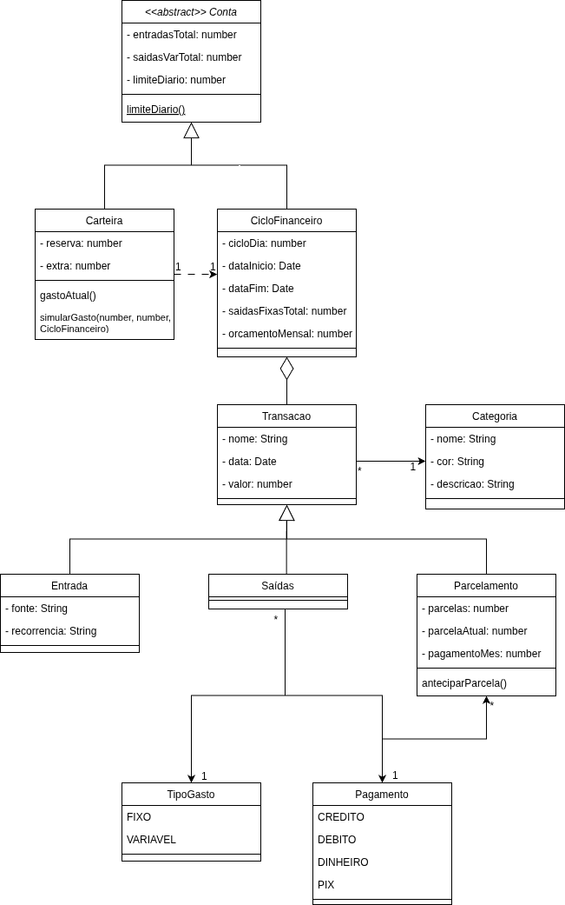
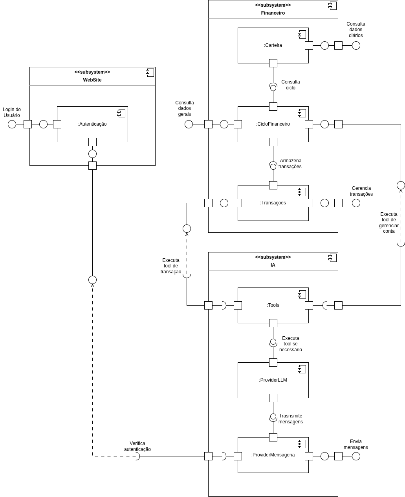
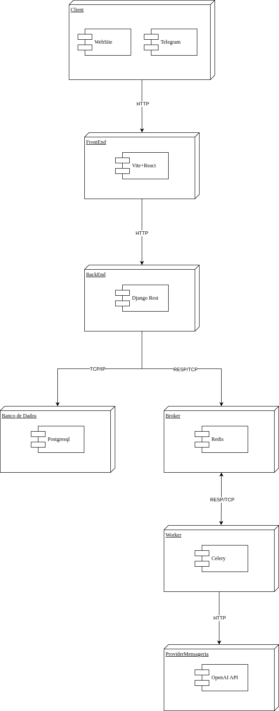

# 2.1. Módulo Notação UML – Modelagem Estática

## Diagrama de Classes

### Introdução

O **Diagrama de Classes** é um dos diagramas estruturais mais importantes da UML (*Unified Modeling Language*), utilizado para representar a estrutura estática de um sistema orientado a objetos [1]. Ele modela as **classes** do sistema com seus atributos e operações, bem como os **relacionamentos** entre elas, tais como associações, generalizações, composições e dependências [1][2].

No contexto deste projeto, o Diagrama de Classes foi elaborado no **nível conceitual/de análise**, com o objetivo de representar as principais entidades do domínio financeiro identificadas no [backlog do projeto (Decision)](Modelagem/Base/DesignSprint/Decision.md), seus atributos e os relacionamentos entre elas.

### Metodologia

A construção do Diagrama de Classes seguiu uma abordagem de primeiro identificar as entidades e depois definir seus atributos e relacionamentos, partindo dos artefatos produzidos nas etapas anteriores do Design Sprint:

**Identificação das entidades**: As classes foram extraídas diretamente das *Features* e *User Stories* do [Product Backlog](Modelagem/Base/DesignSprint/Decision.md), onde cada funcionalidade descreve a criação de uma entidade específica (ex: Criar a entidade Entrada, Criar a entidade Saída).
**Definição de atributos**: Os atributos de cada classe foram derivados das *Tasks* das User Stories, que especificam os campos que o usuário pode informar (ex: nome, valor, categoria, forma de pagamento).
**Mapeamento de relacionamentos**: As associações entre classes foram identificadas a partir das regras de negócio descritas nos critérios de aceite e nas dependências entre Features (ex: Saída depende de Categoria).

Para a criação correta do diagrama de classes, foi consultado o material disponibilizado pela professora. O diagrama foi criado utilizando a ferramenta Draw.io [4].

<b>Imagem 1:</b> Diagrama de Classes

---

## Diagrama de Componentes

### Introdução

O **Diagrama de Componentes** é um dos diagramas estruturais da UML (*Unified Modeling Language*) utilizado para representar a organização e as dependências entre os **componentes** de um sistema de software [5]. Esse diagrama permite visualizar a **arquitetura física** do sistema, evidenciando como os módulos se conectam por meio de interfaces fornecidas e requeridas [1].

No contexto deste projeto, o Diagrama de Componentes foi elaborado com o objetivo de representar a organização arquitetural do sistema financeiro, identificando os principais módulos e suas respectivas interações, além de registrar a lógica de negócio.

### Metodologia

A construção do Diagrama de Componentes seguiu uma abordagem baseada na decomposição arquitetural do sistema, partindo do [Diagrama de Classes](Modelagem/2.1.ModelagemEstatica.md#diagrama-de-classes) e dos requisitos funcionais identificados nas etapas anteriores do projeto:

**Identificação dos subsistemas**: O sistema foi decomposto em três subsistemas principais: **WebSite**, **Conta** e **IA**, seguindo o princípio de separação de responsabilidades [3]. Cada subsistema agrupa componentes com responsabilidades bem definidas [5].

**Mapeamento dos componentes internos**: Dentro de cada subsistema, os componentes foram definidos a partir das entidades e funcionalidades identificadas no Diagrama de Classes. O subsistema *Conta* abrange os componentes `:Carteira`, `:CicloFinanceiro` e `:Transações`; o subsistema *WebSite* contém o componente `:Autenticação`; e o subsistema *IA* agrupa os componentes `:Tools` e `:ProviderMensageria`.

**Definição das interfaces e dependências**: As interfaces fornecidas e requeridas foram estabelecidas com base nos fluxos de dados e nas interações entre os módulos (ex: *Login do Usuário*, *Consulta dados gerais*, *Armazena transações*, *Executa tool de transação*, *Verifica autenticação*, entre outras)[5].

O diagrama foi criado utilizando a ferramenta Draw.io [4].

<b>Imagem 2:</b> Diagrama de Componentes

---

## Diagrama de Implantação

### Introdução

O **Diagrama de Implantação** é um diagrama estrutural da UML utilizado para modelar a arquitetura física (hardware) e a distribuição dos componentes de software (*artefatos*) nos nós de processamento [1][5]. Segundo Pressman e Maxim (2021), esse diagrama ilustra o ambiente no qual o sistema será executado, mostrando o hardware, o software básico e as conexões de rede [3].

### Metodologia

A construção do Diagrama de Implantação baseou-se na [arquitetura do sistema](Modelagem/2.1.ModelagemEstatica.md#diagrama-de-componentes) gerada, definindo os nós onde os subsistemas serão executados:

**Mapeamento de Nós (Nodes)**: Foram identificados cinco nós principais: o nó *Client* (dispositivo do usuário final, acessando via WebSite ou Telegram), os servidores de *FrontEnd*, *BackEnd*, o servidor de *Banco de Dados* e o nó parceiro *ProviderMensageria* [1][3].

O diagrama foi criado utilizando a ferramenta Draw.io [4].

<b>Imagem 3:</b> Diagrama de Implantação

--- 

## Conclusão

O módulo de integração com OpenAI e Celery não foi incluído no Diagrama de Classes de domínio, pois representa uma **camada de infraestrutura/integração**, não entidades do domínio financeiro. Essa separação segue o princípio de **separação de responsabilidades** entre camadas [3]. Devido a isso, o Diagrama de Classes ficou bem compacto, mas atendendo a todos os requisitos do projeto e o necessário para o funcionamento do produto.

Já o **Diagrama de Componentes** complementa essa visão ao representar a organização arquitetural do sistema em três subsistemas: *WebSite*, *Conta* e *IA*, representando o módulo de IA que não pode ser modelado no Diagrama de Classes. Com esse Diagrama é possível visualizar como os componentes se relacionam e como os dados fluem entre eles, incluindo como a IA interage com o sistema, o que não estava explícito no Diagrama de Classes devido a separação de responsabilidades entre camadas [3].

Essa decomposição reforça a modularidade do sistema e facilita a compreensão das dependências e dos fluxos de comunicação entre as camadas, um diagrama complementa o outro, conseguindo representar o que não era possível com apenas um.

Por fim, o **Diagrama de Implantação** complementa essa arquitetura de software ao mapear a distribuição física e lógica dos componentes nos nós de execução. Ele mostra a infraestrutura, os protocolos de comunicação (como HTTP e TCP/IP) e as tecnologias que serão utilizadas no projeto para implementar o sistema (como Vite+React, Django Rest, PostgreSQL).

## Referências

[1] BOOCH, Grady; RUMBAUGH, James; JACOBSON, Ivar. **UML: Guia do Usuário**. 2. ed. Rio de Janeiro: Elsevier, 2005. ISBN: 978-8535217841.

[2] FOWLER, Martin. **UML Essencial: Um Breve Guia para a Linguagem-Padrão de Modelagem de Objetos**. 3. ed. Porto Alegre: Bookman, 2005. ISBN: 978-8560031382.

[3] PRESSMAN, Roger S.; MAXIM, Bruce R. **Engenharia de Software: Uma Abordagem Profissional**. 9. ed. Porto Alegre: AMGH, 2021. ISBN: 978-6558040101.

[4] JGRAPH LTD. **Draw.io**. Disponível em: [https://www.drawio.com/](https://www.drawio.com/). Acesso em: 14 abr. 2026.

[5] SOMMERVILLE, Ian. **Engenharia de Software**. 9. ed. São Paulo: Pearson Prentice Hall, 2011. ISBN: 978-8579361081.

## Histórico de Versão

| Versão | Data | Descrição | Autor |
|--------|------|-----------|-------|
| 1.0 | 14/04/2026 | Criação do documento de Modelagem Estática com Diagrama de Classes | Equipe G8 |
| 1.1 | 17/04/2026 | Adição dos Diagramas de Componentes e Implantação | Equipe G8 |
