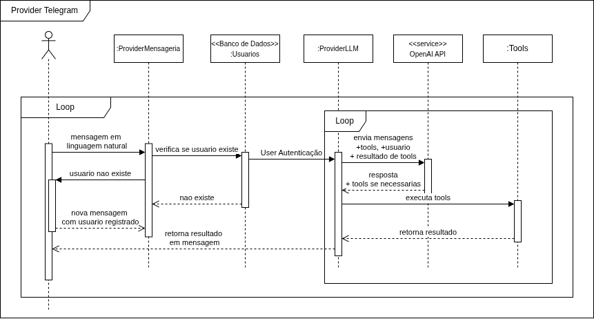

# 2.2. Módulo Notação UML – Modelagem Dinâmica

## Diagrama de Sequência

### Introdução

O **Diagrama de Sequência** é um diagrama comportamental da UML que mostra como os objetos de um sistema interagem ao longo do tempo, destacando a ordem das mensagens trocadas entre eles [1][2]. Por mostrar *como* um cenário acontece em tempo de execução, é um dos diagramas mais usados na fase de projeto [1][3].

Neste projeto, o Diagrama de Sequência foi feito para representar o fluxo de **registro de movimentações financeiras por linguagem natural via Telegram**. Esse cenário foi escolhido por envolver um fluxo complicado de se representar em outros diagramas, pois envolve o *ProviderMensageria*, a autenticação do usuário, a chamada ao modelo de linguagem (*ProviderLLM*) e a execução das *tools* solicitadas pelo usuário. Ele também é o principal diferencial do produto, conforme as *Features* de IA do [Product Backlog](Modelagem/Base/DesignSprint/Decision.md).

### Metodologia

O diagrama foi montado a partir do [Diagrama de Componentes](Modelagem/2.1.ModelagemEstatica.md#diagrama-de-componentes), que já tinha definido os subsistemas e suas interfaces, e das *User Stories* do [Product Backlog](Modelagem/Base/DesignSprint/Decision.md). A construção seguiu estas etapas:

1. **Escolha do cenário**: foi escolhido o fluxo de envio de mensagem via Telegram porque ele usa o subsistema de IA econcentra as principais decisões ligadas à IA do produto.
2. **Identificação dos participantes (*lifelines*)**: foram definidas seis linhas de vida — o *Ator* (usuário final), `:ProviderMensageria`, `<<Banco de Dados>> :Usuarios`, `:ProviderLLM`, o serviço externo `<<service>> OpenAI API` e `:Tools`. Foram reaproveitados os mesmos componentes do Diagrama de Componentes, para manter a rastreabilidade entre as duas visões, com exceção de componentes mais tecnicos como o Banco de Dados e o serviço externo[1].
3. **Ordem das mensagens**: as mensagens seguem as regras das *User Stories* de autenticação e registro por IA — `enviaMensagem()` → `validateUser()` → (fluxo de `Autenticar()`, quando o usuário ainda não existe) → `enviarMensagens(tools, usuario, resultado_de_tools)` → execução das *tools* até a LLM montar a resposta em linguagem natural.
4. **Uso de fragmentos combinados**: foram usados dois *loops*. O externo mostra que a conversa entre usuário e *ProviderMensageria* é contínua. O interno mostra o ciclo de *function calling* entre `:ProviderLLM` e `:Tools`, que pode se repetir até a LLM chegar à resposta final [2].

O diagrama foi criado na ferramenta Draw.io [4].

<b>Imagem 1:</b> Diagrama de Sequência do fluxo de registro de movimentações via Telegram.

## Conclusão

O Diagrama de Sequência mostrou o lado temporal do sistema, que a [Modelagem Estática](Modelagem/2.1.ModelagemEstatica.md) não consegue representar: a ordem em que o usuário é validado antes de qualquer chamada à LLM, o ciclo entre `:ProviderLLM` e `:Tools` (que permite registrar uma transação em mais de um passo) e o retorno da resposta ao usuário pelo *ProviderMensageria*. Assim, o diagrama completa o Diagrama de Componentes ao mostrar *como* as interfaces definidas antes funcionam em tempo de execução, e reforça a rastreabilidade entre as visões estática e dinâmica do sistema [1][2].

## Referências

[1] BOOCH, Grady; RUMBAUGH, James; JACOBSON, Ivar. **UML: Guia do Usuário**. 2. ed. Rio de Janeiro: Elsevier, 2005. ISBN: 978-8535217841.

[2] FOWLER, Martin. **UML Essencial: Um Breve Guia para a Linguagem-Padrão de Modelagem de Objetos**. 3. ed. Porto Alegre: Bookman, 2005. ISBN: 978-8560031382.

[3] PRESSMAN, Roger S.; MAXIM, Bruce R. **Engenharia de Software: Uma Abordagem Profissional**. 9. ed. Porto Alegre: AMGH, 2021. ISBN: 978-6558040101.

[4] JGRAPH LTD. **Draw.io**. Disponível em: [https://www.drawio.com/](https://www.drawio.com/). Acesso em: 19 abr. 2026.

## Histórico de Versão

| Versão | Data | Descrição | Autor |
|--------|------|-----------|-------|
| 1.0 | 18/04/2026 | Criação do documento de Modelagem Dinâmica com Diagrama de Sequência | Equipe G8 |
