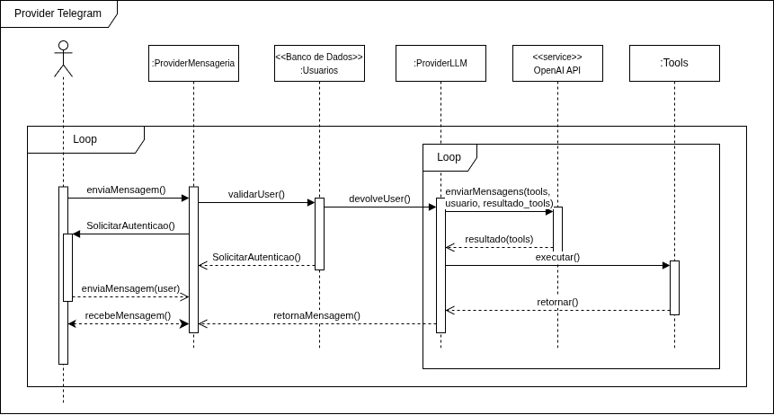
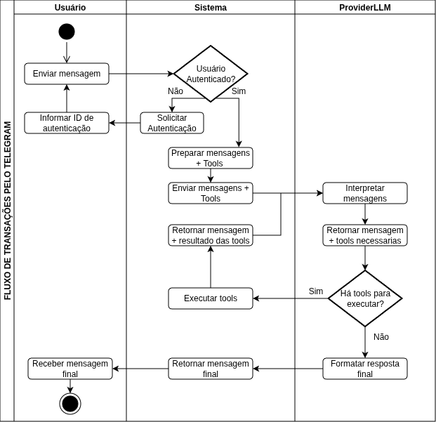

# 2.2. Módulo Notação UML – Modelagem Dinâmica

## Diagrama de Sequência

### Introdução

O **Diagrama de Sequência** é um diagrama comportamental da UML que mostra como os objetos de um sistema interagem ao longo do tempo, destacando a ordem das mensagens trocadas entre eles [1][2]. Por mostrar *como* um cenário acontece em tempo de execução, é um dos diagramas mais usados na fase de projeto [1][3].

Neste projeto, o Diagrama de Sequência foi feito para representar o fluxo de **registro de movimentações financeiras por linguagem natural via Telegram**. Esse cenário foi escolhido por envolver um fluxo complicado de se representar em outros diagramas, pois envolve o *ProviderMensageria*, a autenticação do usuário, a chamada ao modelo de linguagem (*ProviderLLM*) e a execução das *tools* solicitadas pelo usuário. Ele também é o principal diferencial do produto, conforme as *Features* de IA do [Product Backlog](Modelagem/Base/DesignSprint/Decision.md).

### Metodologia

O diagrama foi montado a partir do [Diagrama de Componentes](Modelagem/2.1.ModelagemEstatica.md#diagrama-de-componentes), que já tinha definido os subsistemas e suas interfaces, e das *User Stories* do [Product Backlog](Modelagem/Base/DesignSprint/Decision.md). A construção seguiu estas etapas:

1. **Escolha do cenário**: foi escolhido o fluxo de envio de mensagem via Telegram porque ele usa o subsistema de IA econcentra as principais decisões ligadas à IA do produto.
2. **Identificação dos participantes (*lifelines*)**: foram definidas seis linhas de vida — o *Ator* (usuário final), `:ProviderMensageria`, `<<Banco de Dados>> :Usuarios`, `:ProviderLLM`, o serviço externo `<<service>> OpenAI API` e `:Tools`. Foram reaproveitados os mesmos componentes do Diagrama de Componentes, para manter a rastreabilidade entre as duas visões, com exceção de componentes mais tecnicos como o Banco de Dados e o serviço externo[1].
3. **Ordem das mensagens**: as mensagens seguem as regras das *User Stories* de autenticação e registro por IA — `enviaMensagem()` → `validateUser()` → (fluxo de `Autenticar()`, quando o usuário ainda não existe) → `enviarMensagens(tools, usuario, resultado_de_tools)` → execução das *tools* até a LLM montar a resposta em linguagem natural.
4. **Uso de fragmentos combinados**: foram usados dois *loops*. O externo mostra que a conversa entre usuário e *ProviderMensageria* é contínua. O interno mostra o ciclo de *function calling* entre `:ProviderLLM` e `:Tools`, que pode se repetir até a LLM chegar à resposta final [2].

O diagrama foi criado na ferramenta Draw.io [4].

<b>Imagem 1:</b> Diagrama de Sequência do fluxo de registro de movimentações via Telegram, VERSÃO 1.

Após mais estudos, foi possível perceber que as semânticas das setas estavam incorretas, pois não indicavam um fluxo de execução. Com isso, um novo diagrama foi gerado.

<b>Imagem 2:</b> Diagrama de Sequência do fluxo de registro de movimentações via Telegram, VERSÃO 2.

## Diagrama de Atividades

### Introdução

O **Diagrama de Atividades** é um diagrama comportamental da UML que modela o fluxo de controle de uma atividade, representando a sequência de ações, decisões e fluxos paralelos que compõem um processo [1][2]. 

Neste projeto, o Diagrama de Atividades foi elaborado para representar o fluxo de **registro de movimentações financeiras via Telegram**, o mesmo cenário modelado no [Diagrama de Sequência](Modelagem/2.2.ModelagemDinamica.md#diagrama-de-sequência). A escolha desse cenário permite complementar a visão temporal do Diagrama de Sequência com uma visão centrada nas **decisões e caminhos alternativos** do processo, como a verificação de autenticação do usuário e o ciclo de chamadas à LLM.

### Metodologia

A construção do Diagrama de Atividades partiu do [Diagrama de Sequência](Modelagem/2.2.ModelagemDinamica.md#diagrama-de-sequência) já elaborado e das *User Stories* do [Product Backlog](Modelagem/Base/DesignSprint/Decision.md), seguindo estas etapas:

1. **Identificação das ações**: cada mensagem relevante do Diagrama de Sequência foi mapeada como uma ação no fluxo, garantindo rastreabilidade entre os dois diagramas [1][2].
2. **Definição dos nós de decisão**: foram identificados os pontos de ramificação do fluxo, como a verificação de autenticação do usuário e a decisão da LLM sobre executar ou não uma *tool* [3].
3. **Uso de partições (*swimlanes*)**: o diagrama foi organizado em raias para separar as responsabilidades de cada participante: Usuário, *Sistema*(englobando *ProviderMensageria* e *Tools*) e *ProviderLLM*, mantendo coerência com os componentes do [Diagrama de Componentes](Modelagem/2.1.ModelagemEstatica.md#diagrama-de-componentes) [1].
4. **Representação de ciclos**: o ciclo de *Tool Calls* entre a LLM e as *Tools* foi representado por meio de um fluxo de retorno, evidenciando que a execução pode se repetir até a LLM produzir a resposta final.

O diagrama foi criado utilizando a ferramenta Draw.io [4].

<b>Imagem 3:</b> Diagrama de Atividades do fluxo de registro de movimentações via Telegram.

## Conclusão

O **Diagrama de Sequência** mostrou o lado temporal do sistema, que a [Modelagem Estática](Modelagem/2.1.ModelagemEstatica.md) não consegue representar: a ordem em que o usuário é validado antes de qualquer chamada à LLM, o ciclo entre `:ProviderLLM` e `:Tools` (que permite registrar uma transação em mais de um passo) e o retorno da resposta ao usuário pelo *ProviderMensageria*. Assim, o diagrama completa o Diagrama de Componentes ao mostrar *como* as interfaces definidas antes funcionam em tempo de execução [1][2].

O **Diagrama de Atividades**, por sua vez, complementa o Diagrama de Sequência ao evidenciar a lógica de **decisão e ramificação** do mesmo fluxo: os caminhos alternativos de autenticação, as condições de execução das *tools* e o ciclo de *Tool Calls* [1][3].

Dessa forma, os dois diagramas deste módulo oferecem visões complementares da dinâmica do sistema, reforçando a rastreabilidade entre as visões estática e dinâmica do projeto e completando os diagramas de [Classes](Modelagem/2.1.ModelagemEstatica.md#diagrama-de-classes), [Componentes](Modelagem/2.1.ModelagemEstatica.md#diagrama-de-componentes) e [Implantação](Modelagem/2.1.ModelagemEstatica.md#diagrama-de-implantação) da Modelagem Estática.

## Referências

[1] BOOCH, Grady; RUMBAUGH, James; JACOBSON, Ivar. **UML: Guia do Usuário**. 2. ed. Rio de Janeiro: Elsevier, 2005. ISBN: 978-8535217841.

[2] FOWLER, Martin. **UML Essencial: Um Breve Guia para a Linguagem-Padrão de Modelagem de Objetos**. 3. ed. Porto Alegre: Bookman, 2005. ISBN: 978-8560031382.

[3] PRESSMAN, Roger S.; MAXIM, Bruce R. **Engenharia de Software: Uma Abordagem Profissional**. 9. ed. Porto Alegre: AMGH, 2021. ISBN: 978-6558040101.

[4] JGRAPH LTD. **Draw.io**. Disponível em: [https://www.drawio.com/](https://www.drawio.com/). Acesso em: 19 abr. 2026.

## Histórico de Versão

| Versão | Data | Descrição | Autor |
|--------|------|-----------|-------|
| 1.0 | 18/04/2026 | Criação do documento de Modelagem Dinâmica com Diagrama de Sequência | Equipe G8 |
| 1.1 | 23/04/2026 | Adição do Diagrama de Atividades | Equipe G8 |
