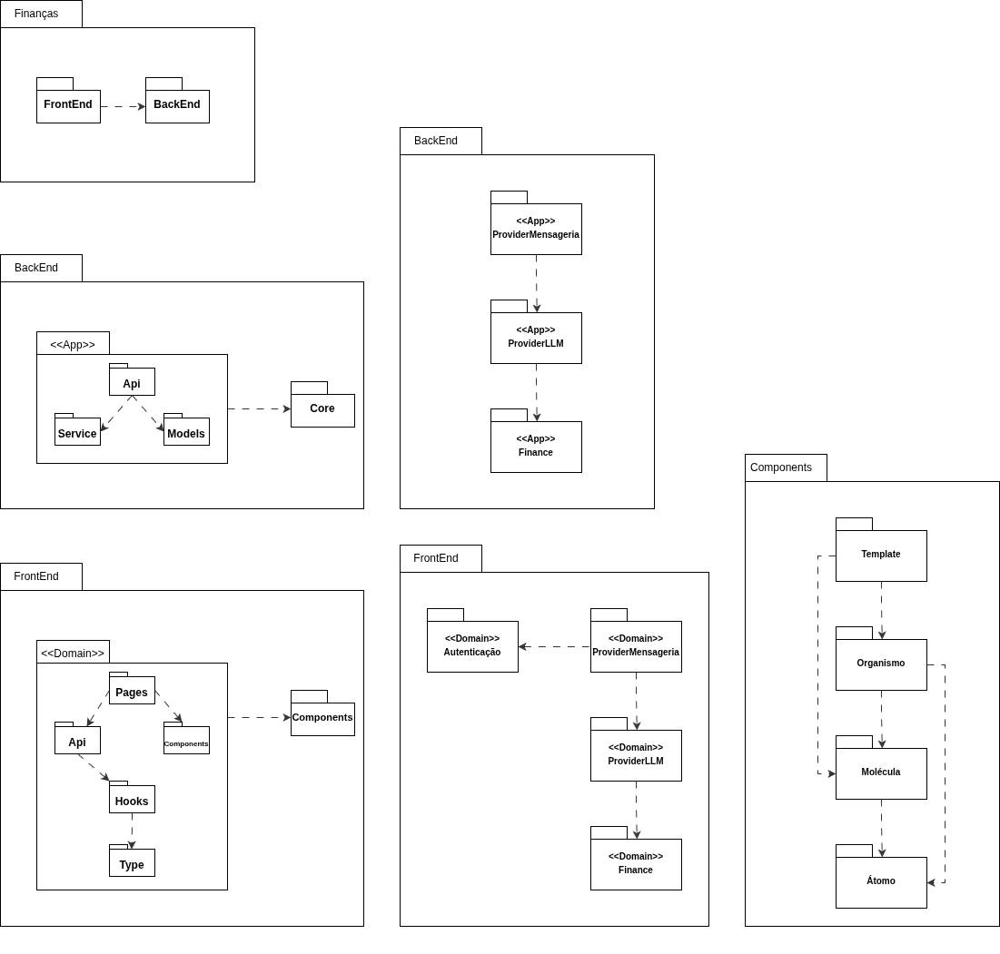
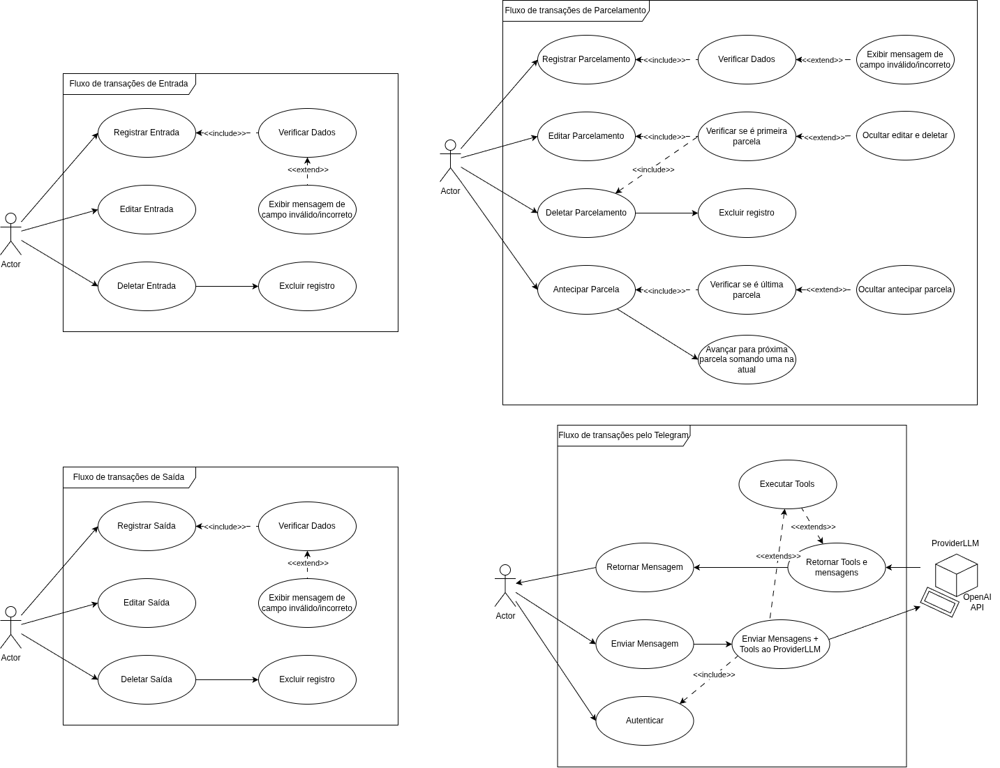

# 2.3. Módulo Notação UML – Modelagem Organizacional OU Casos de Uso

## Diagrama de Pacotes

### Introdução

O **Diagrama de Pacotes** é um diagrama organizacional da UML (*Unified Modeling Language*) utilizado para representar o agrupamento lógico dos elementos de um sistema em **pacotes**, evidenciando as dependências entre eles [1][2]. Esse tipo de diagrama é especialmente útil para sistemas de médio e grande porte, pois permite visualizar a **organização arquitetural** de forma hierárquica, facilitando o entendimento das fronteiras entre módulos e a gestão da complexidade [3].

No contexto deste projeto, o sistema *Finanças* adota uma **arquitetura cliente-servidor**, na qual o *FrontEnd* (cliente) e o *BackEnd* (servidor) são módulos independentes que se comunicam por meio de uma API. Dentro de cada um desses módulos, por sua vez, a organização segue um estilo de **n-camadas internas** [3], com responsabilidades segregadas em pacotes distintos. O Diagrama de Pacotes, apresentado a seguir, foi elaborado justamente para evidenciar essa organização em múltiplos níveis, complementando o [Diagrama de Componentes](Modelagem/2.1.ModelagemEstatica.md#diagrama-de-componentes) ao descer até o agrupamento lógico dos módulos de implementação.

### Metodologia

A construção do Diagrama de Pacotes seguiu uma abordagem de decomposição, partindo da visão geral do sistema até o detalhamento interno de cada camada, com base no [Diagrama de Componentes](Modelagem/2.1.ModelagemEstatica.md#diagrama-de-componentes) e nas decisões arquiteturais registradas no [backlog do projeto (Decision)](Modelagem/Base/DesignSprint/Decision.md):

**Visão geral do sistema**: No nível mais alto, o pacote *Finanças* agrupa os dois grandes módulos da aplicação, *FrontEnd* e *BackEnd*, mostrando a dependência do *FrontEnd* em relação ao *BackEnd* [1].

**Decomposição do BackEnd**: O *BackEnd* foi decomposto seguindo o padrão arquitetural do **Django Rest Framework**, adotado no projeto. Cada aplicação (`<<App>>`) encapsula um conjunto de responsabilidades, onde *Api*, *Service* e *Models* compõem a estrutura interna de cada app, e todas dependem de um pacote *Core*. As três aplicações principais identificadas são: `<<App>> Finance` (domínio financeiro), `<<App>> ProviderLLM` (integração com a OpenAI) e `<<App>> ProviderMensageria` (integração com o Telegram) [5].

**Decomposição do FrontEnd**: O *FrontEnd* foi organizado por **domínios** (`<<Domain>>`). Cada domínio agrupa *Pages*, *Api*, *Hooks* e *Type*, e consome um pacote transversal *Components*. Os domínios identificados: *Autenticação*, *Finance*, *ProviderLLM* e *ProviderMensageria*, espelham as aplicações do *BackEnd*, garantindo **rastreabilidade** entre as camadas.

**Organização do pacote Components (Atomic Design)**: O pacote *Components* do *FrontEnd* foi estruturado segundo a metodologia **Atomic Design** proposta por Brad Frost [6], em quatro níveis hierárquicos: *Átomo* → *Molécula* → *Organismo* → *Template*. Cada nível depende dos níveis inferiores, promovendo **reutilização** e **consistência visual** entre as telas.

O diagrama foi criado utilizando a ferramenta Draw.io [4].

<b>Imagem 1:</b> Diagrama de Pacotes do sistema.

## Diagrama de Casos de Uso

### Introdução

O **Diagrama de Casos de Uso** é um diagrama comportamental da UML (*Unified Modeling Language*) utilizado para descrever as funcionalidades de um sistema do ponto de vista do **usuário** (ator), representando os serviços (*casos de uso*) que o sistema oferece e as interações entre atores e esses serviços [1][2]. Introduzido por Jacobson (1992) [7], o diagrama é amplamente empregado na fase de levantamento de requisitos, pois fornece uma visão de alto nível do **escopo funcional** do sistema, facilitando a comunicação entre desenvolvedores e *stakeholders* [3].

No contexto deste projeto, o Diagrama de Casos de Uso foi elaborado para representar as principais funcionalidades do sistema *Finanças*, identificando os atores envolvidos e os serviços disponibilizados pela aplicação, com base nas *Features* e *User Stories* definidas no [backlog do projeto (Decision)](Modelagem/Base/DesignSprint/Decision.md).

### Metodologia

A construção do Diagrama de Casos de Uso seguiu uma abordagem orientada pelos requisitos funcionais do sistema, partindo dos artefatos produzidos nas etapas anteriores do projeto:

**Identificação dos atores**: Os atores foram extraídos das *User Stories* do [Product Backlog](Modelagem/Base/DesignSprint/Decision.md), representando os papéis externos que interagem com o sistema [1][7].

**Levantamento dos casos de uso**: Cada caso de uso foi derivado das *Features* e *User Stories*, mapeando as funcionalidades que o sistema deve oferecer aos seus atores (ex: registrar transação, interagir via Telegram) [2][3].

**Definição dos relacionamentos**: Os relacionamentos entre atores e casos de uso, bem como entre os próprios casos de uso (extensões e inclusões), foram estabelecidos com base nas dependências e regras de negócio descritas nos critérios de aceite [1][5].

O diagrama foi criado utilizando a ferramenta Draw.io [4].

<b>Imagem 2:</b> Diagrama de Casos de Uso do sistema.

---

## Conclusão

O **Diagrama de Pacotes** apresentado permite compreender a organização estrutural do sistema *Finanças* em diferentes níveis de granularidade, partindo da separação macro entre *FrontEnd* e *BackEnd* até a decomposição interna de cada camada em aplicações e domínios.

A escolha por espelhar os domínios do *FrontEnd* nas aplicações do *BackEnd* (*Finance*, *ProviderLLM*, *ProviderMensageria*) reforça a **coesão** e **rastreabilidade** entre as camadas, facilitando a manutenção e a evolução do sistema [3]. Além disso, a adoção do **Atomic Design** no pacote *Components* promove a reutilização de elementos de interface e contribui para a consistência visual do produto [6].

O **Diagrama de Casos de Uso**, por sua vez, complementa a visão organizacional ao apresentar o sistema sob a perspectiva dos seus **atores**, evidenciando o escopo funcional da aplicação e os serviços que ela disponibiliza [1][7].

Dessa forma, os dois diagramas deste módulo complementam os diagramas anteriores: [Classes](Modelagem/2.1.ModelagemEstatica.md#diagrama-de-classes), [Componentes](Modelagem/2.1.ModelagemEstatica.md#diagrama-de-componentes), [Implantação](Modelagem/2.1.ModelagemEstatica.md#diagrama-de-implantação) e [Sequência](Modelagem/2.2.ModelagemDinamica.md#diagrama-de-sequência), ao oferecer tanto uma visão organizacional do código-fonte quanto uma visão funcional centrada no usuário, evidenciando os agrupamentos lógicos e o escopo de funcionalidades que guiarão a implementação do projeto.

## Referências

[1] BOOCH, Grady; RUMBAUGH, James; JACOBSON, Ivar. **UML: Guia do Usuário**. 2. ed. Rio de Janeiro: Elsevier, 2005. ISBN: 978-8535217841.

[2] FOWLER, Martin. **UML Essencial: Um Breve Guia para a Linguagem-Padrão de Modelagem de Objetos**. 3. ed. Porto Alegre: Bookman, 2005. ISBN: 978-8560031382.

[3] PRESSMAN, Roger S.; MAXIM, Bruce R. **Engenharia de Software: Uma Abordagem Profissional**. 9. ed. Porto Alegre: AMGH, 2021. ISBN: 978-6558040101.

[4] JGRAPH LTD. **Draw.io**. Disponível em: [https://www.drawio.com/](https://www.drawio.com/). Acesso em: 20 abr. 2026.

[5] SOMMERVILLE, Ian. **Engenharia de Software**. 9. ed. São Paulo: Pearson Prentice Hall, 2011. ISBN: 978-8579361081.

[6] FROST, Brad. **Atomic Design**. 1. ed. Pittsburgh: Brad Frost Web, 2016. Disponível em: [https://atomicdesign.bradfrost.com/](https://atomicdesign.bradfrost.com/). Acesso em: 20 abr. 2026.

[7] JACOBSON, Ivar. **Object-Oriented Software Engineering: A Use Case Driven Approach**. 1. ed. Boston: Addison-Wesley, 1992. ISBN: 978-0201544350.

## Histórico de Versão

| Versão | Data | Descrição | Autor |
|--------|------|-----------|-------|
| 1.0 | 20/04/2026 | Criação do documento de Modelagem Organizacional com Diagrama de Pacotes | Equipe G8 |
| 1.1 | 21/04/2026 | Adição do Diagrama de Casos de Uso | Equipe G8 |
