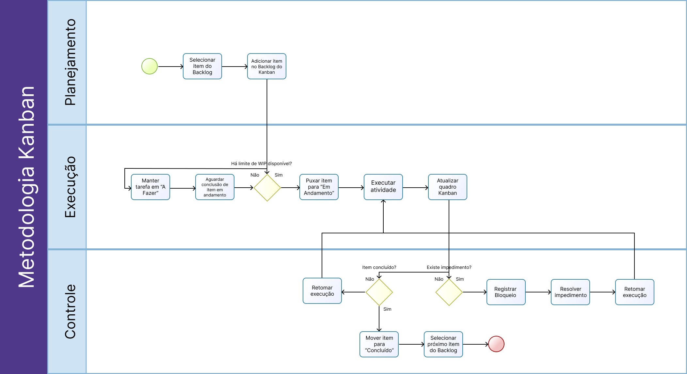

# 1.3. Módulo Modelagem BPMN

## Metodologia da Equipe

O Kanban, originado no Sistema Toyota de Produção e adaptado para o desenvolvimento de software por David J. Anderson, é um método de gestão de fluxo de trabalho baseado em alguns princípios e práticas fundamentais [1]:

- **Visualização do fluxo de trabalho**: utiliza-se um quadro (físico ou digital) dividido em colunas que representam os estágios do processo (ex.: _A Fazer_, _Em Progresso_, _Concluído_). Cada item de trabalho é representado por um cartão que se move entre as colunas conforme avança no fluxo.
- **Limitação do trabalho em progresso (WIP)**: define-se um número máximo de itens que podem estar em andamento simultaneamente em cada etapa, evitando sobrecarga e promovendo o foco na conclusão das tarefas antes de iniciar novas.
- **Gerenciamento do fluxo**: o objetivo central é manter um fluxo contínuo e previsível de entrega, identificando e eliminando gargalos no processo, como bloqueios e impedimentos.

A equipe por ser composta por apenas uma pessoa, optou por seguir com a metodologia Kanban, sendo essa uma metodologia ágil que permite uma maior flexibilidade e adaptação às necessidades do projeto. Por ser uma metodologia de fluxo contínuo e sem papeis obrigatórios, se adequa bem a equipes individuais.

## Modelagem BPMN

A **Business Process Model and Notation (BPMN)** é um padrão gráfico mantido pelo _Object Management Group_ (OMG) para modelagem de processos de negócio. O BPMN é amplamente utilizado para representar fluxos de trabalho, facilitando a comunicação entre stakeholders técnicos e não técnicos e servindo como base para a identificação de requisitos e a automação de processos [2]. A notação oferece elementos como eventos, atividades, gateways e fluxos de sequência, permitindo descrever desde processos simples até orquestrações complexas de forma padronizada e compreensível [3].

 

## Referências

[1] ANDERSON, David J. **Kanban: Successful Evolutionary Change for Your Technology Business**. Sequim: Blue Hole Press, 2010.
[2] DUMAS, Marlon et al. **Fundamentals of Business Process Management**. 2. ed. Berlim: Springer, 2018.
[3] OBJECT MANAGEMENT GROUP. **Business Process Model and Notation (BPMN) Version 2.0**. OMG, 2011. Disponível em: [https://www.omg.org/spec/BPMN/2.0](https://www.omg.org/spec/BPMN/2.0). Acesso em: 12 abr. 2026.

## Histórico de Versão

| Versão | Data | Descrição | Autor |
|--------|------|-----------|-------|
| 1.0 | 01/03/2026 | Criação do documento de modelagem BPMN | Equipe G8 |
| 2.0 | 12/04/2026 | Adição de referência | Equipe G8 |
