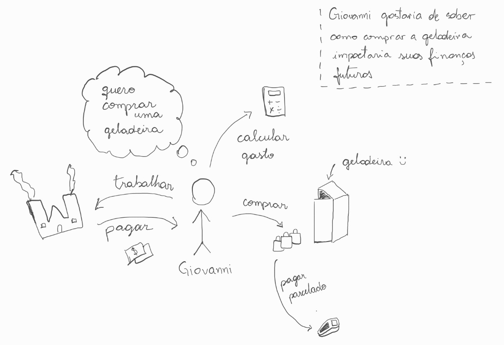
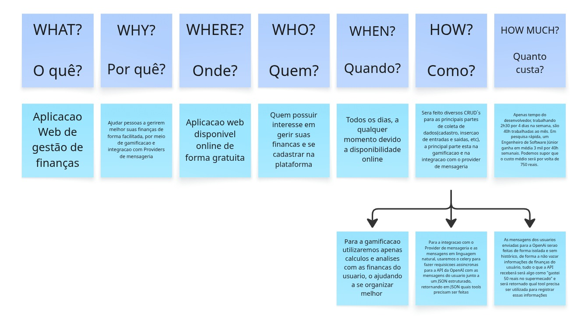

# Sketch 

## Introdução 

A etapa de **Sketch** é a segunda fase do Design Sprint, conforme proposto por Jake Knapp [1]. Enquanto a fase anterior — [Unpack](Unpack.md) — foca em entender o problema e reunir contexto, a fase de Sketch tem como objetivo **divergir e gerar o máximo de soluções possíveis** para o desafio identificado. Nessa etapa, cada membro da equipe trabalha individualmente para esboçar ideias concretas, incentivando a exploração criativa sem restrições prematuras [1].

## Metodologia

Como a equipe possui apenas uma pessoa, fica um pouco difícil de aplicar as metodologias de forma tradicional para divergir. Portanto, foram utilizadas três técnicas complementares para explorar o problema sob diferentes perspectivas: **Rich Picture**, **5W2H** e **Mapa Mental**.

### Rich Picture

O Rich Picture é uma técnica de modelagem visual, de caráter informal e pouco estruturado, utilizada para representar situações complexas de forma acessível [2]. Trata-se de um desenho que ilustra os principais elementos e relacionamentos de um cenário, permitindo capturar em um único diagrama os atores, processos, preocupações e fluxos de informação envolvidos [2]. Por ser uma técnica visual e intuitiva, é ideal para ser utilizada no início do processo de elicitação, pois não exige conhecimento técnico prévio nem uma orientação metodológica rígida para sua criação [3].

Neste projeto, o Rich Picture foi elaborado **a partir da perspectiva de uma persona** definida na etapa de [Unpack](Unpack.md). Ao adotar o ponto de vista de um usuário representativo — com suas dores, necessidades e contexto de uso — foi possível mapear de forma mais realista o cenário do problema, identificando os atores envolvidos, as relações entre eles e os problemas que enfrentam.

 

### 5W2H

O 5W2H é uma ferramenta de planejamento utilizada para elaborar planos de ação de forma clara e objetiva. No contexto da engenharia de software, Pressman e Maxim [4] apresentam o princípio **W5HH**, um framework de planejamento de projetos baseado em sete perguntas fundamentais: **What** (O quê?), **Why** (Por quê?), **Where** (Onde?), **When** (Quando?), **Who** (Quem?), **How** (Como?) e **How Much** (Quanto custa?) [4]. Ao responder essas perguntas, é possível documentar de forma direta e estruturada as principais definições do projeto, reduzindo ambiguidades e alinhando expectativas.

No contexto deste projeto, o 5W2H foi utilizado para sintetizar as decisões de alto nível sobre o produto, definindo escopo, motivação, público-alvo, cronograma, responsáveis e abordagem técnica. Para a pergunta "Como", foi consultada a documentação oficial da OpenAI [5] como referência para a integração com inteligência artificial.

 

### Mapa Mental

O Mapa Mental é uma técnica de organização visual de ideias criada por Tony Buzan [6], que consiste em um diagrama hierárquico onde conceitos e palavras-chave são conectados a um nó central por meio de ramificações. Essa técnica facilita a associação livre de ideias, a categorização de informações e a identificação de relações entre conceitos [6].

Como o objetivo desta etapa é divergir e explorar soluções, o Mapa Mental foi selecionado para representar graficamente todas as ideias, funcionalidades e conceitos levantados durante as fases de [Unpack](Unpack.md) e Sketch, organizando-os de forma hierárquica e conectada ao tema central do projeto de finanças pessoais.

 

## Conclusão

Foram gerados três artefatos com o objetivo de divergir e gerar o máximo de soluções possíveis para o problema, seguindo com o propósito da etapa de Sketch no Design Sprint [1]. O **Rich Picture** permitiu compreender o contexto do problema a partir da visão de uma persona, identificando atores, fluxos e preocupações de forma empática. O **5W2H** documentou as definições fundamentais do projeto de maneira estruturada e objetiva. O **Mapa Mental** organizou visualmente as ideias e conceitos gerados, facilitando a identificação de relações e hierarquias entre funcionalidades. Juntos, esses artefatos forneceram uma base sólida para a tomada de decisão na etapa seguinte — [Decision](Decision.md).

## Referências

[1] KNAPP, Jake; ZERATSKY, John; KOWITZ, Braden. **Sprint: How to Solve Big Problems and Test New Ideas in Just Five Days**. Nova York: Simon & Schuster, 2016. ISBN: 978-1501121746.

[2] BARBOSA, Simone D. J. et al. **Interação Humano-Computador e Experiência do Usuário**. Autopublicação, 2021. Capítulo 5 — Identificação de Necessidades dos Usuários e Requisitos de IHC. ISBN: 978-65-00-19677-1.

[3] MONK, Andrew; HOWARD, Steve. **The Rich Picture: A Tool for Reasoning About Work Context**. Interactions, v. 5, n. 2, p. 21–30, mar. 1998. DOI: 10.1145/274430.274434.

[4] PRESSMAN, Roger S.; MAXIM, Bruce R. **Engenharia de Software: Uma Abordagem Profissional**. 9. ed. Porto Alegre: AMGH, 2021. ISBN: 978-6558040101.

[5] OPENAI. Plataforma de API. Disponível em: https://openai.com/pt-BR/api/. Acesso em: 23 mar. 2026.

[6] BUZAN, Tony. **Mapas Mentais: Métodos Criativos para Estimular o Raciocínio e Usar ao Máximo o Potencial do seu Cérebro**. Rio de Janeiro: Sextante, 2009. ISBN: 978-8575425848.

## Histórico de Versão

| Versão | Data | Descrição | Autor |
|--------|------|-----------|-------|
| 1.0 | 23/03/2026 | Criação do sketch do projeto | Equipe G8 |
| 2.0 | 12/04/2026 | Adição de referências bibliográficas | Equipe G8 |